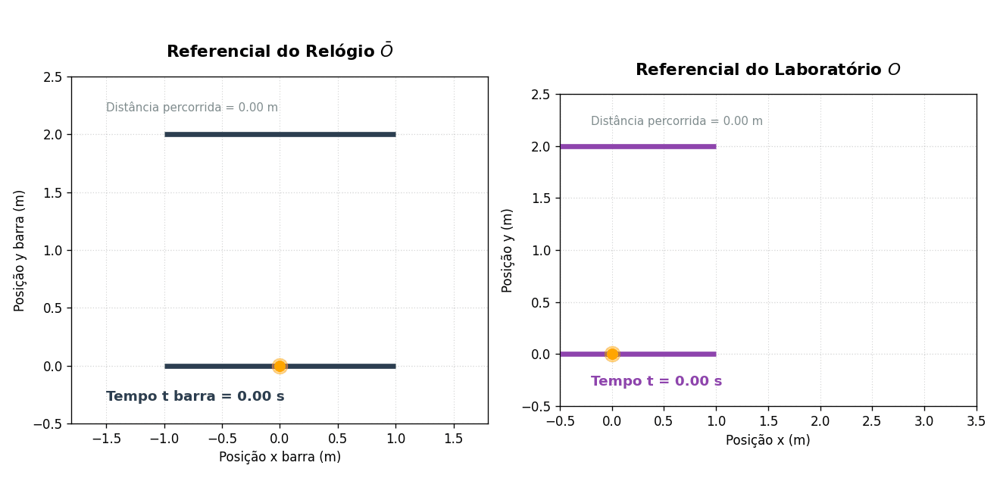
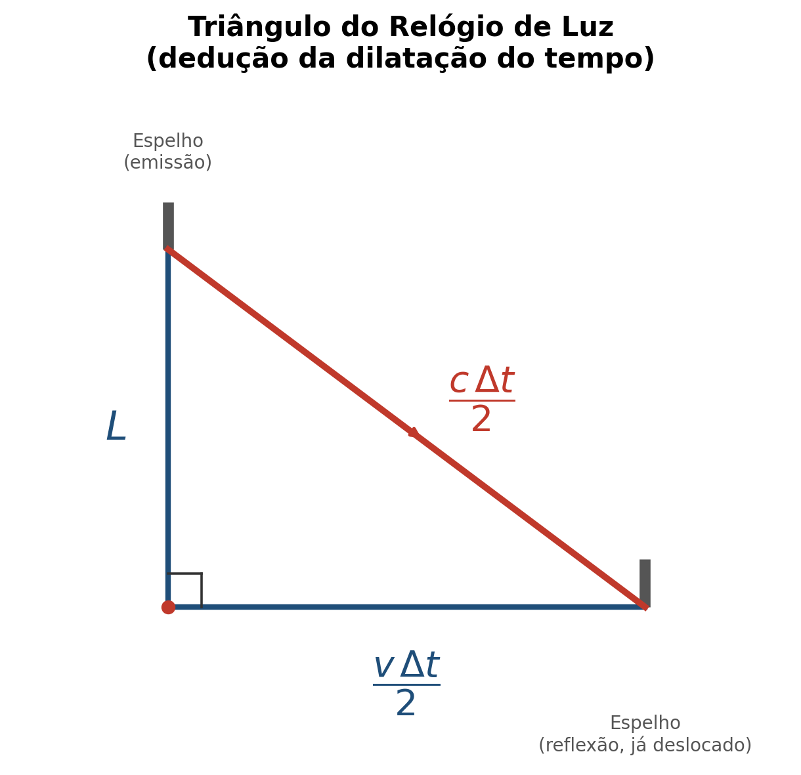
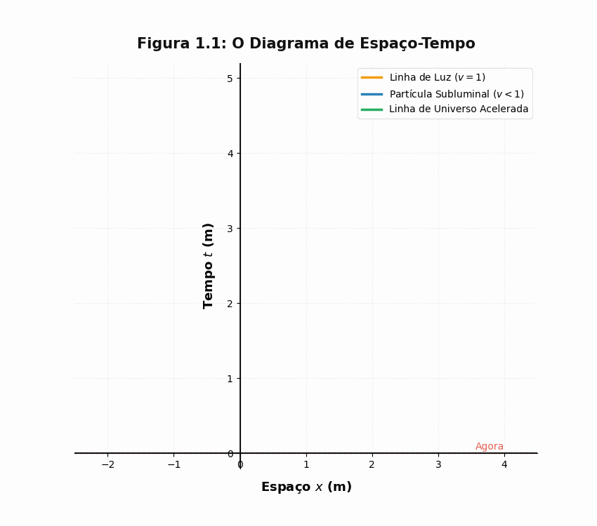
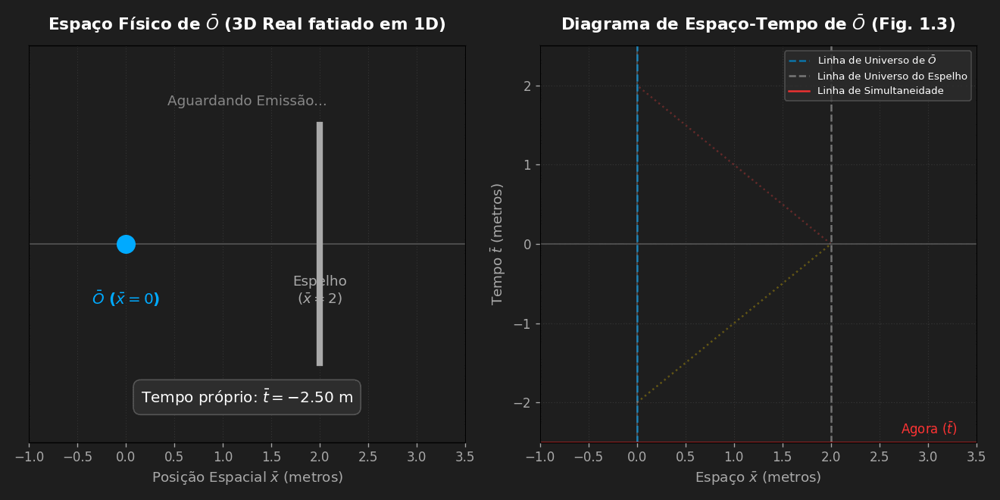
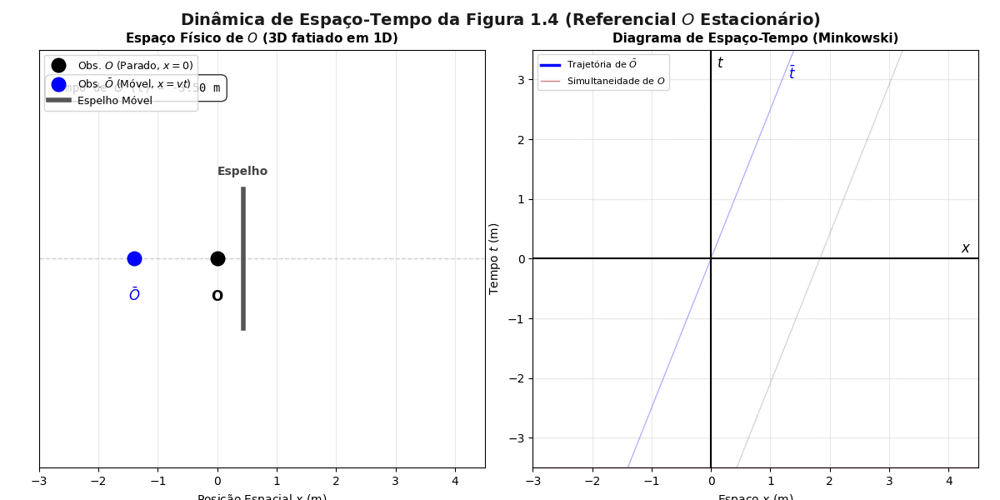
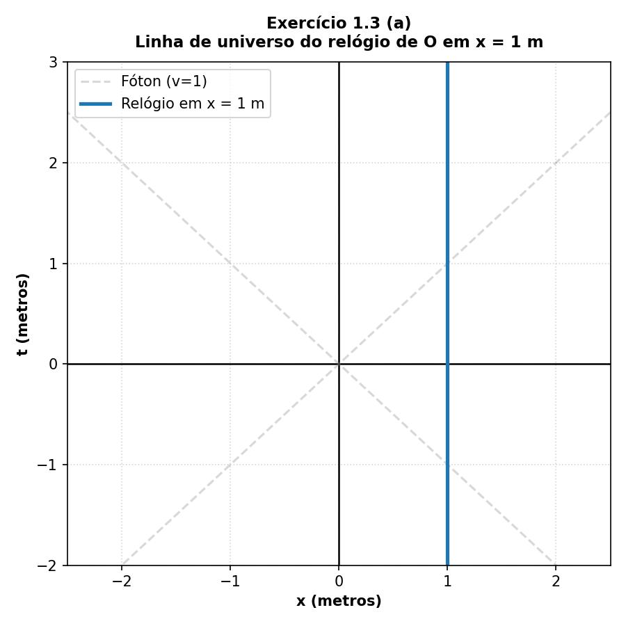
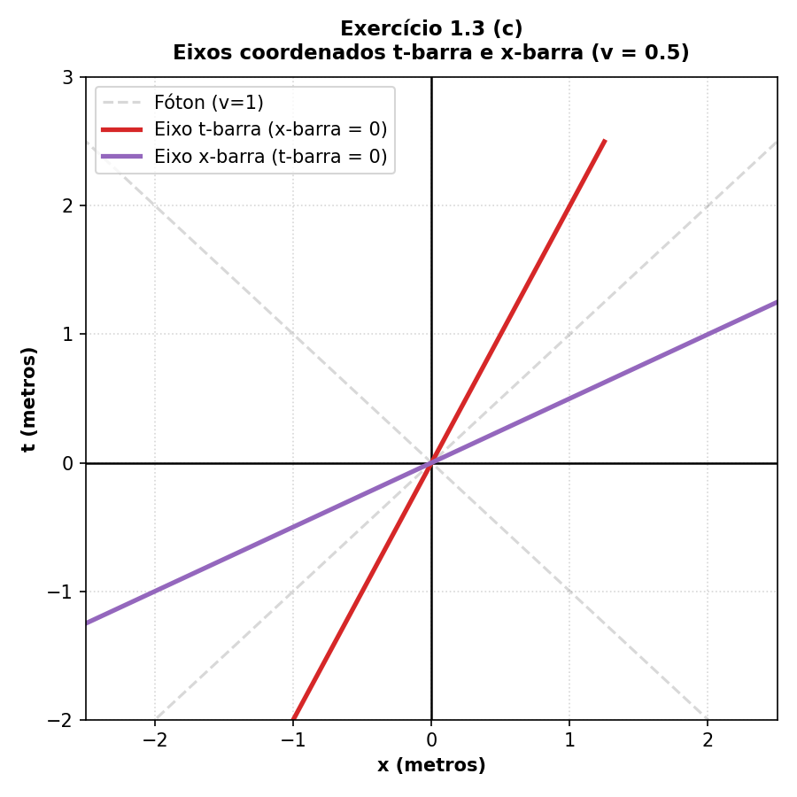
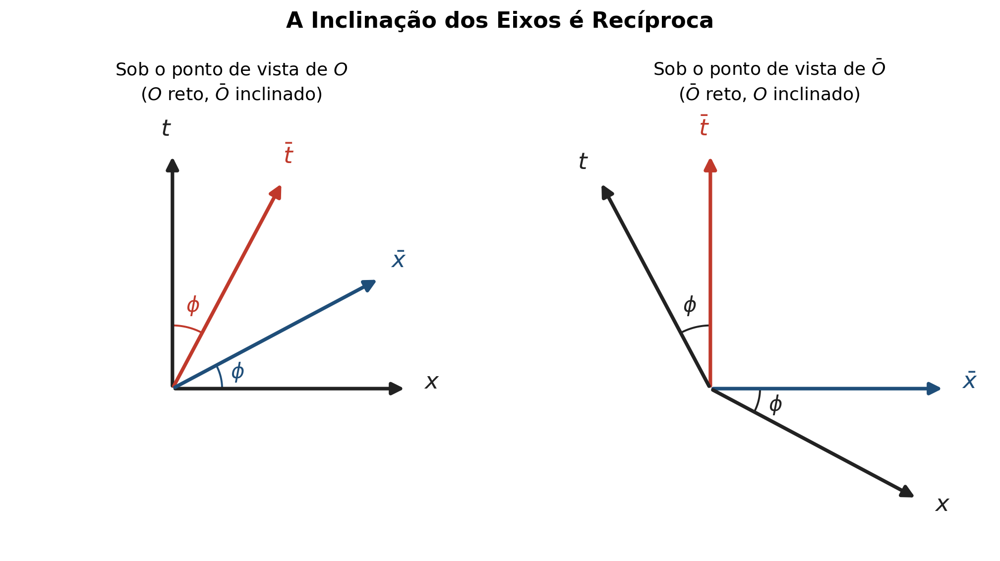

# Geometria do Espaço-Tempo: Diagrama de Minkowski

Luana M. Souza

*Uma introdução visual à dilatação do tempo e aos diagramas de espaço-tempo de Minkowski*

> **Notação:** ao longo do post, $O$ é o referencial *parado* (por exemplo, alguém na estação) e $\bar{O}$ (lê-se "O-barra") é o referencial que *se move* com velocidade $v$ em relação a $O$ (por exemplo, o viajante carregando o relógio de luz). Cada referencial mede o tempo com seu próprio relógio, daí a barra para diferenciar $\bar t$ de $t$.

---

## 1. O Experimento Mental — O Relógio de Luz

Imagine o relógio mais simples possível: **dois espelhos paralelos** e um **pulso de luz (fóton)** quicando de cima para baixo entre eles. Cada vez que a luz bate no espelho de cima, o relógio faz *"tique-taque"*.

Por que usamos a luz? Porque, pelo postulado de Einstein, **a velocidade da luz é uma constante absoluta**, ela é sempre a mesma para qualquer observador, não importa o quão rápido ele esteja se movendo, além disso, está diretamente ligada à estrutura do universo. Por isso, um relógio que usa a luz é o único instrumento que mede o tempo de forma "pura".

  

---

## 2. O Conflito de Perspectivas

Agora colocamos esse relógio em movimento e analisamos duas situações (exatamente como mostra o GIF acima):

- **A visão do viajante ($\bar{O}$):** para o observador que segura o relógio, o aparelho está parado na sua mão. A luz simplesmente sobe e desce em uma **linha vertical**. O caminho é curto, então o tempo passa normalmente.

- **A visão de quem está na estação ($O$):** para o observador parado, o relógio está correndo para o lado. Enquanto a luz viaja de um espelho para o outro, o relógio se desloca. Para não errar o espelho, a luz é obrigada a fazer um **caminho em diagonal (zig-zag)**.

Como a velocidade da luz é exatamente a mesma para os dois observadores, e o caminho em diagonal é geometricamente **mais longo** que o caminho reto vertical, a luz **demora mais tempo** para completar uma batida na visão do observador parado.

A conclusão física é inevitável:

> **O tempo passa mais devagar para quem está em movimento** (a Dilatação do Tempo).

### Quanto o tempo dilata, exatamente?

O argumento geométrico acima pode virar uma fórmula usando o teorema de Pitágoras. Chame de $L$ a distância entre os espelhos e de $\Delta \bar t$ o tempo de um "tique-taque" completo medido por quem carrega o relógio ($\bar O$). Nesse referencial a luz percorre $2L$, então $c \Delta \bar t = 2L$.

  

Para o observador parado $O$, durante o tempo $\Delta t$ o relógio se deslocou uma distância $v\Delta t$. O caminho da luz é a hipotenusa de um triângulo retângulo com perna vertical $L$ e perna horizontal $v\Delta t/2$ (metade do percurso horizontal, referente só à subida ou só à descida):

$$\left(\frac{c \Delta t}{2}\right)^2 = L^2 + \left(\frac{v \Delta t}{2}\right)^2$$

Substituindo $L = c \Delta \bar t/2$ e isolando $\Delta t$:

$$\Delta t = \frac{\Delta \bar t}{\sqrt{1 - v^2/c^2}} = \gamma \Delta \bar t, \qquad \gamma \equiv \frac{1}{\sqrt{1-v^2/c^2}}$$

$\gamma$ é o famoso **fator de Lorentz**. Como $\gamma \ge 1$ sempre, temos $\Delta t \ge \Delta \bar t$: o relógio em movimento sempre "atrasa" do ponto de vista de quem o vê passar — confirmando algebricamente o que já havíamos concluído geometricamente.

Um exemplo numérico (usando o mesmo $v$ do Exercício 1.3.c de Schutz, para $v = 0{,}5c$,

$$\gamma = \frac{1}{\sqrt{1 - 0{,}25}} = \frac{1}{\sqrt{0{,}75}} \approx 1{,}155$$

Ou seja, cada segundo marcado pelo relógio em movimento corresponde a cerca de 1,155 segundo para o observador parado.

### Um paradoxo aparente: e o contrário também vale?

Uma dúvida natural: se $O$ vê o relógio de $\bar O$ atrasado, $\bar O$ não deveria ver o relógio de $O$ *adiantado*? Não — a dilatação do tempo é **recíproca**: cada observador, em seu próprio referencial, vê o relógio do outro andando mais devagar. Isso não é uma contradição porque simultaneidade não é absoluta (é o que vamos ver na Seção 4): os dois discordam sobre quais eventos acontecem "ao mesmo tempo", e é exatamente essa discordância que permite que os dois relógios pareçam atrasados um em relação ao outro, sem violar lógica alguma. Não existe um referencial "certo", só referenciais diferentes, cada um internamente consistente.

---

## 3. A Ponte para os Diagramas de Espaço-Tempo (Minkowski)

Como visualizar essa "estranheza" em um gráfico? É aqui que entram os diagramas de espaço-tempo (Seção 1.4 de Bernard Schutz):

- Em vez de desenhar o espaço-tempo em 4 dimensões, desenhamos uma folha de papel onde o **Tempo ($t$) corre na vertical** e o **Espaço ($x$) corre na horizontal**.
- Cada ponto nesse papel não é apenas um lugar, mas um **Evento** — algo que acontece em um lugar $x$ e em um instante $t$.
- O caminho que um objeto percorre ao longo do tempo é a sua **Linha de Universo** (*world line*):
  - Se você estiver parado na estação (referencial $O$), sua linha é uma **reta perfeitamente vertical**.
  - Se você estiver se movendo (como o viajante $\bar{O}$), sua linha é uma **reta inclinada**.
  - E a **luz**? Como adotamos unidades onde $c = 1$ (um metro de tempo é o tempo que a luz leva para percorrer um metro), a trajetória de um fóton é sempre uma **reta a 45°**.

Uma linha nesse diagrama fornece uma relação $x = x(t)$, e portanto pode representar a posição de uma partícula em momentos diferentes, isso é a linha de universo da partícula. Sua inclinação está relacionada à sua velocidade:

$$\text{inclinação} = \frac{dt}{dx} = \frac{1}{v}$$

Como para a luz um metro percorrido equivale a um metro de tempo, sua velocidade permanece adimensional ($c = 1$), e por isso sua inclinação nesse diagrama é sempre de **45°**.

  

Algumas convenções do Schutz:

- Os eventos são denotados por letras maiúsculas caligráficas, por exemplo, $\mathcal{A}, \mathcal{B}, \mathcal{P}$. A letra $O$ é reservada para denotar observadores.

- As coordenadas são chamadas de $(t, x, y, z)$. Por por exemplo $(5, -3, 2, 10^{16})$, denota um evento; neste caso, as coordenadas são $t=5, x=-3, y=2, z=10^{16}$. Portanto, sempre colocamos $t$ primeiro. Todas as coordenadas são medidas em metros.

- Frequentemente é conveniente referir-se às coordenadas $(t, x, y, z)$ pelos os nomes alternativos de $(x^0, x^1, x^2, x^3)$. Esses índices superiores não são expoentes, mas apenas índices. Assim, $(x^3)^2$ denota o quadrado da coordenada 3 (que é $z$), e não o quadrado do cubo de $x$. As coordenadas $x^0, x^1, x^2$ e $x^3$ são referidas como $x^\alpha$. Um índice grego (por exemplo, $\alpha, \beta, \mu, \nu$) pode assumir um valor do conjunto $(0, 1, 2, 3)$. Se não for atribuído um valor a $\alpha$, então $x^\alpha$ pode ser qualquer uma das quatro coordenadas. Se quisermos nos referir a todas as coordenadas, usamos chaves: ${x^\alpha}$.

- Usa-se índices latinos para as coordenadas espaciais. Assim, um índice latino (por exemplo, $a, b, i, j, k, l$) assume um valor do conjunto $(1, 2, 3)$. Se não for atribuído um valor a $i$, então $x^i$ será qualquer uma das três coordenadas espaciais.

---

## 4. Como Desenhar o "Agora" de Outro Observador?

Esta é a parte conceitualmente mais profunda — e a que costuma dar o nó na cabeça.

Imagine um observador $\bar{O}$ viajando a uma velocidade $v$, munido de um relógio de luz, o observador dispara um fóton do relógio e observa o fóton ser emitido, refletido e coletado. Como devem ser traçados os eventos de emissão, reflexão e recepção do fóton no diagrama espaço-tempo do próprio $\bar{O}$?

Lembre-se que para  $\bar{O}$ ele está parado e para responder essa pergunta precisamos analisar a sequência de eventos:

1. O viajante $\bar{O}$ dispara um fóton de sua origem no tempo $\bar{t} = -2\text{ m}$ (**Evento $\xi$**).
2. A luz viaja a 45°, bate no espelho do relógio e reflete (**Evento $\mathcal{P}$**).
3. A luz volta (também a 45°) e é recebida por $\bar{O}$ no tempo $\bar{t} = +2\text{ m}$ (**Evento $\mathcal{R}$**).

  

Como a velocidade da luz é constante, o viajante sabe que a reflexão ($\mathcal{P}$) **aconteceu exatamente na metade do tempo de viagem**, ou seja, no seu tempo $\bar{t} = 0$.

Para $\bar{O}$, a sua origem $(0,0)$ e o Evento $\mathcal{P}$ aconteceram **no mesmo instante**. Se traçarmos uma linha reta unindo a origem ao Evento $\mathcal{P}$, **essa linha é o próprio eixo espacial $\bar{x}$ de $\bar{O}$**!

### O choque de realidades

E quando o observador parado $O$ desenha essa mesma cena?

- Ele vê o espelho se mover, então a ida da luz é mais longa que a volta.
- Para $O$, o Evento de reflexão $\mathcal{P}$ ocorre em um tempo positivo ($t > 0$), acima da horizontal.
- Por consequência, o eixo $\bar{x}$ de $\bar{O}$ (a linha que une a origem a $\mathcal{P}$) **fica inclinado para cima** no papel de $O$!

  

Isso prova graficamente a **Relatividade da Simultaneidade**: o que o viajante $\bar{O}$ considera como seu "tempo zero" não é o que o observador parado $O$ considera como seu "tempo zero". 

> A geometria do espaço-tempo força os eixos coordenados a se inclinarem.

---

## 5. Praticando: o Exercício 1.3 do Schutz

Um bom jeito de fixar a construção dos diagramas é resolver um exercício clássico do Capítulo 1 do livro do Schutz: dado um referencial $O$ parado, pede-se para desenhar (a) a linha de universo de um relógio de  $O$ parado em $x=1\text{ m}$; (c) os eixos $\bar t$ e $\bar x$ de um observador $\bar O$ que se move com $v=0{,}5$ na direção $x$ positiva, com origem coincidindo com a de $O$ ($\bar t$ = $\bar x$ = 0.

Vamos focar nos itens (a) e (c), que ilustram bem a lógica dos diagramas.

### (a) A linha de universo de um relógio parado

  

Um objeto parado em $x=1\text{ m}$ no referencial de $O$ nunca muda de posição espacial, ele só "anda" no tempo. No diagrama isso é simplesmente uma **reta vertical em $x=1$**, paralela ao eixo $t$, para qualquer valor de $t$. É o caso mais simples de linha de universo: velocidade zero corresponde a uma reta vertical (perpendicular ao eixo espacial) neste gráfico, já que aqui o tempo corre na vertical.

### (c) Os eixos de um observador em movimento

Aqui aplicamos exatamente a lógica da Seção 4, agora para uma velocidade genérica $v$:

- O eixo $\bar t$ (reta vermelha) é a **linha de universo da origem de $\bar O$**, o caminho do próprio observador em movimento pelo espaço-tempo. Como $\bar O$ se move segundo $x = vt$, isolando $t$ temos $t = x/v$, uma reta com inclinação $(dt/dx = 1/v) = (1/0{,}5 = 2)$. Por isso a reta vermelha é mais "em pé" que a diagonal de 45° do fóton, quanto mais perto $v$ chega de $c$, mais o eixo $\bar t$ se aproxima dessa diagonal, mas nunca a alcança.
  
- O eixo $\bar x$ (reta roxa) é a **linha de simultaneidade de $\bar O$**, o conjunto de eventos que $\bar O$ considera acontecer no seu "tempo zero" $\bar t = 0$, construído do mesmo jeito que fizemos com o Evento $\mathcal P$ na Seção 4. Essa reta tem inclinação recíproca à do eixo $\bar t$: $dt/dx = v = 0{,}5$.

  

Note que a função que descreve $\bar{t}$ é uma função afim, pois a velocidade é constante:

$$\{t} = F(\{x}) = a\{x} + b$$

Como $\bar{x} = \bar{t} = 0$, coincide com $\{x} = \{t} = 0$, temos que $b = 0$. Portanto:

$$\{t} = a\{x}$$

Como a inclinação do eixo do observador $\bar O$ é $a = 2$, obtemos:

$$\boxed{\{t} = 2\{x}}$$

### Traçando $\bar{t}$

Para traçar $\bar{t}$, substituímos os pontos na equação $\{t} = 2\{x}$ e ligamos os pontos correspondentes.

### Traçando $\bar{x}$

Para traçar $\bar{x}$, lembremos que o ângulo formado entre $\{t}$ e $\bar{t}$ é igual ao ângulo entre $\{x}$ e $\bar{x}$, portanto existe uma simetria em torno da linha de universo do fóton inclinada a 45°. 

  

Com esta informação somos capazes de traçar $\bar{x}$ uma vez que:

$$\boxed{\tan(\phi) = \frac{CO}{CA}}$$

Assim, para $\{t}$ = 1 temos x = 0,5; para x = 1 temos t = 0,5.

Observe que os triângulos retângulos são iguais, devido a simetria!

---

## Referências

- SCHUTZ, Bernard. *A First Course in General Relativity*. 3ª ed. Cambridge: Cambridge University Press, 2022. — Capítulo 1, Seções 1.4 e 1.5, e Exercício 1.3.
- Max Planck Institute for Gravitational Physics (Albert Einstein Institute). **From light clocks to time dilation**. Einstein Online. Disponível em: <https://www.einstein-online.info/en/spotlight/light-clocks-time-dilation/>.

---

*Post baseado no experimento mental do relógio de luz e nos diagramas de Minkowski, seguindo a abordagem do livro de Bernard Schutz, "A First Course in General Relativity".*
